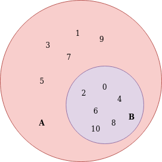

# Estudos sobre Conjuntos

[Voltar](../README.md)

---

### $${\color{lightblue}Entendendo \space um \space Conjunto}$$

* Um conjunto é uma coleção de elementos

|Símbolo|Significado
|---|---|
|A = {0,1}| Conjunto chamado A com dois elementos dentro
|$$\emptyset \space ou \{\}$$| É o conjunto vazio

* Os membros de um conjunto é chamado de **elementos**.

---

### $${\color{lightgreen}Verificando \space elementos \space em \space um \space conjunto}$$

* Podemos verificar se um elementos **pertencem** a um conjunto.

|Símbolo|Significado
|---|---|
|$$\in$$|Verifica se o elemento pertence ao conjunto
|$$\in!$$|Verifica se o elemento não pertence ao conjunto

$$0 \space \in \space A$$

Significa se 0 é um elemento do conjunto A ou se **0 pertence ao conjunto A**.

$$2 \space \in! \space A$$

Significa se 2 não é um elemento do conjunto A ou se **2 não pertence ao conjunto A**

Conjuntos podem também ser descritivos através de uma especificação das propriedade dos seus elementos.

Podemos dizer se um elemento pertence a um conjunto particular, como dos **Números Naturais**.

$$A =  \{x \in \N | x < 5\}$$

Essa simbologia acima significa que o conjunto A possui um elemento `x` pertencente aos números naturais, onde `x` é um número menor do que 5, dessa forma está querendo dizer que os números pertencente aos conjunto A são:

**A = {0,1,2,3,4}**, já que os números naturais são todos positivos maiores ou igual a zero

---

### $${\color{yellow}Entendendo \space Subconjuntos}$$

Um subconjunto é um conjunto onde todos os elementos dele pertencem a um outro conjunto.

Podemos dizer que temos um conjunto de números naturais que vai de 0 á 10

$$A = \{x \in \N | x <= 10\}$$

ou seja

A = {0,1,2,3,4,5,6,7,8,9,10}

Agora temos um conjunto B que tem números pares até 0 10.

$$B = \{x \in \N | x/2 \}$$

ou seja

B = {0,2,4,6,8,10}

Por isso podemos dizer o seguinte:

$$B \subset A$$

|Símbolo|Significado
|---|---|
|$$\subset$$| **Está contido**

Com isso estamos dizendo que o conjunto B **está contido dentro** do conjunto A

